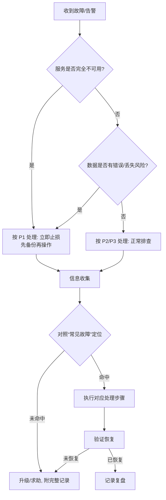

# 数据库故障排查流程（Database Troubleshooting Flow）

本文件是数据库出现异常时的标准排查流程（runbook）。目标是**快速定位、止损、恢复**，
并在过程中保留可复盘的记录。命令示例基于本仓库的 `dbauto` CLI（`status` / `migrate` /
`seed` / `query`），并适用于其底层的 SQLite 数据库；接入其他数据库时，替换为对应客户端命令即可。

> 约定：下文用 `<URL>` 表示目标库，例如 `sqlite:///path/to/target.db`。
> 所有排查优先在**只读**层面进行，任何写操作（修复、回滚）前必须先备份。

## 0. 快速分诊（Triage）

先用一分钟判断影响面与紧急度，再决定投入多少资源。



**分诊要点**

- 影响面：单个功能 / 整库不可用 / 数据错误？
- 变化点：最近是否有部署、迁移、配置或流量变化？（优先怀疑最近的变更）
- 紧急度：是否影响生产、是否有数据丢失风险 → 决定 P1/P2/P3。

## 1. 信息收集（先看，不要先改）

```bash
# 迁移与 schema 状态：是否有 pending / drifted
dbauto --database-url "<URL>" status

# 目标库文件是否存在、大小、权限、磁盘占用（SQLite）
ls -lh "<数据库文件路径>"
df -h "<数据库所在目录>"

# 抽查关键数据是否可读
dbauto --database-url "<URL>" query "SELECT 1"
```

记录：现象、报错原文、发生时间、最近变更、上述命令输出。

## 2. 常见故障与处理

### 2.1 连接失败 / 打不开数据库

**表现**：命令报 `unable to open database file`、路径不存在、或权限错误。

**排查与处理**：
1. 确认 `<URL>` 路径正确：`sqlite:///` 后为相对路径，`sqlite:////` 为绝对路径。
2. 确认目录存在且当前用户有读写权限：`ls -ld "<目录>"`。
3. 磁盘是否写满：`df -h`（见 2.5）。
4. 修正路径/权限后重试 `dbauto --database-url "<URL>" status`。

### 2.2 有未应用的迁移（pending）

**表现**：`status` 中存在 `pending`；应用行为与预期 schema 不符。

**处理**：
```bash
dbauto --database-url "<URL>" migrate --dry-run   # 先确认将要执行的内容
# 备份后执行
dbauto --database-url "<URL>" migrate
dbauto --database-url "<URL>" status              # 应为 0 pending
```

### 2.3 迁移执行中断 / 失败

**表现**：`migrate` 报错中止，部分迁移已应用、部分未应用。

**处理**：
1. 阅读报错，定位失败的迁移文件（`migrations/<version>_*.sql`）。
2. `dbauto --database-url "<URL>" status` 查看已应用到哪个版本；引擎按文件逐个提交，
   已成功的会记录在 `dbauto_migrations` 表，失败的那个不会被记录，可修复后重跑。
3. 修正该迁移的 SQL 后：
   ```bash
   dbauto --database-url "<URL>" migrate --dry-run
   dbauto --database-url "<URL>" migrate
   ```
4. 若无法就地修复，按第 3 节回滚到备份。

### 2.4 迁移漂移（drifted）

**表现**：`status` 中某迁移标记为 `drifted`——即**已应用的迁移文件在应用后被修改过**
（当前文件校验和与 `dbauto_migrations` 中记录的 `checksum` 不一致）。

**处理**：
1. 用 `git log`/`git diff` 查明该迁移文件为何变化、是否为误改。
2. **不要**通过直接改文件去“对齐”已上线的库。正确做法：把 schema 变更写成
   **一个新的迁移**（新的 `<version>_*.sql`）再 `migrate`。
3. 若确属误改，应将该迁移文件恢复到应用时的内容，使 `checksum` 重新匹配。

### 2.5 数据库被锁定 / 磁盘空间不足

**表现**：`database is locked`、`disk I/O error`、`database or disk is full`。

**处理**：
- 锁定：确认是否有其他进程正持有连接；等待其结束或安全地停止该进程后重试。
  避免多个写入者并发操作同一 SQLite 文件。
- 磁盘：`df -h` 查看占用；清理空间或扩容；SQLite 写入需要额外的临时空间。

### 2.6 权限问题

**表现**：只读文件系统、`readonly database`、无法创建 WAL/临时文件。

**处理**：确认文件与所在目录对执行用户可写（`ls -l`），必要时修正属主/权限后重试。

### 2.7 查询结果不符合预期

**处理**：
1. 先确认 schema 到位：`status` 无 pending/drifted。
2. 用 `dbauto --database-url "<URL>" query "<SELECT ...>"` 逐步缩小范围核对数据。
3. 区分是“数据问题”还是“查询/应用逻辑问题”，避免误改数据。

## 3. 恢复与回滚

任何写操作前先备份；确认无法就地修复时再回滚。

```bash
# 备份（SQLite 直接复制数据文件）
cp "<db文件>" "<db文件>.$(date +%Y%m%d%H%M%S).bak"

# 回滚：用故障前的备份还原
cp "<db文件>.<timestamp>.bak" "<db文件>"

# 还原后验证
dbauto --database-url "<URL>" status
```

## 4. 升级与记录（Escalation & Postmortem）

- **何时升级**：P1 长时间未恢复、存在数据丢失风险、或超出自身处理能力时，
  立即带上“信息收集”与已尝试步骤求助/上报。
- **必须记录**：现象与影响面、时间线、根因、处理动作、验证结果、后续改进项
  （例如补充监控、增加迁移评审、完善备份策略）。

## 附录：常用命令速查

```bash
dbauto --database-url "<URL>" status                 # 迁移/ schema 状态
dbauto --database-url "<URL>" migrate --dry-run      # 预演待执行迁移
dbauto --database-url "<URL>" migrate                # 应用迁移
dbauto --database-url "<URL>" query "<SELECT ...>"   # 只读抽查数据
df -h "<目录>"; ls -lh "<db文件>"                     # 磁盘与文件状态
```
